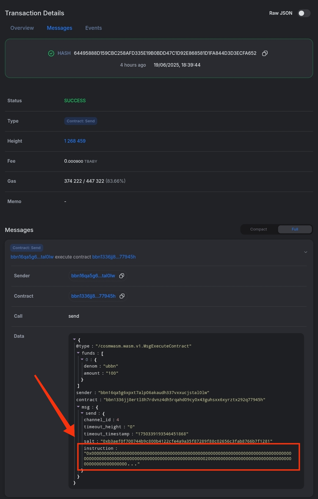

# 🌉 Xion → Sei IBC Transfer Script Setup (with Union Contract)

This guide helps you fully configure and run a script to send IBC messages from **Xion Testnet** to **Sei Testnet** using Union’s CosmWasm contract.

---

## 🚀 Initial Setup

```bash
sudo apt update && sudo apt install -y wget curl git nano tar jq
```

---

## 🛠 Install Go (≥ v1.22)

```bash
wget https://go.dev/dl/go1.22.2.linux-amd64.tar.gz
sudo rm -rf /usr/local/go
sudo tar -C /usr/local -xzf go1.22.2.linux-amd64.tar.gz
echo 'export PATH=$PATH:/usr/local/go/bin' >> ~/.bashrc
source ~/.bashrc
go version
```

---

## 🧪 Install Xion CLI

```bash
git clone https://github.com/burnt-labs/xion
cd xion
make install
xiond version
```

---

## 🔐 Set Up Wallet

```bash
# Create a new wallet (or restore with your mnemonic)
xiond keys add wallet --keyring-backend test
# OR
# xiond keys add wallet --recover --keyring-backend test

# Check address & balance
xiond keys show wallet -a --keyring-backend test
xiond q bank balances $(xiond keys show wallet -a --keyring-backend test) --node https://rpc.xion-testnet-2.burnt.com:443
```

---

## 📜 Clone the Script

```bash
git clone https://github.com/ShinosukaGG/Union-Sei-Script-Guide.git
cd Union-Sei-Script-Guide
```

---

## 🧾 Create IBC Instruction File

```bash
nano instruction.hex
```

Paste the correct `0x...` **hex instruction** string from Union dashboard or manually constructed. Go to https://app.union.build/ and perform a Xion -> Sei transaction. Visit the block explorer and copy the instruction as show below (add `0x` in start):

Save with `Ctrl + O`, then exit with `Ctrl + X`.

---

## ✅ Make Script Executable and Run

```bash
chmod +x xion_to_sei.sh && ./xion_to_sei.sh
```

---

## 🧠 Notes

- The `instruction.hex` file must contain a valid Union instruction (starting with `0x`).
- Script uses `xion-testnet-2` and correct Union contract for sending from Xion to Sei.
- Make sure the source wallet has enough `uxion` balance to cover multiple sends.

---

## ✅ Useful Commands

Add a different wallet:

```bash
xiond keys add wallet --recover --keyring-backend test
```

Check balance:

```bash
xiond q bank balances $(xiond keys show wallet -a --keyring-backend test) --node https://rpc.xion-testnet-2.burnt.com:443
```

Reopen instruction:

```bash
nano instruction.hex
```

Terminate script:

```bash
Ctrl + C
```

---

`If any error/feedback dm me @Shinosuka_eth on Telegram, Twitter or Discord`
